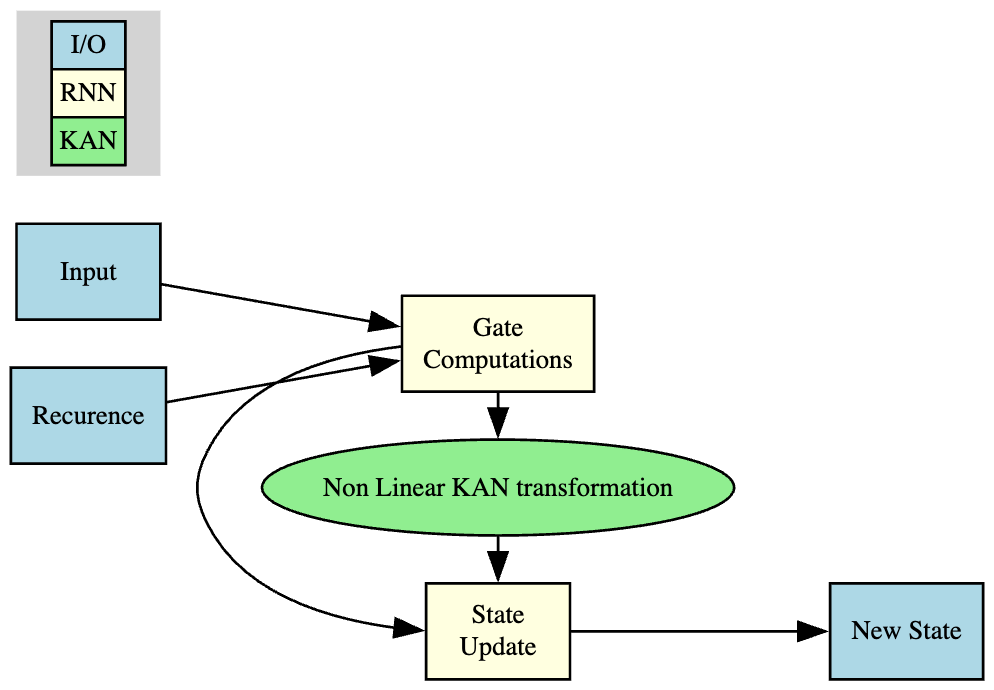
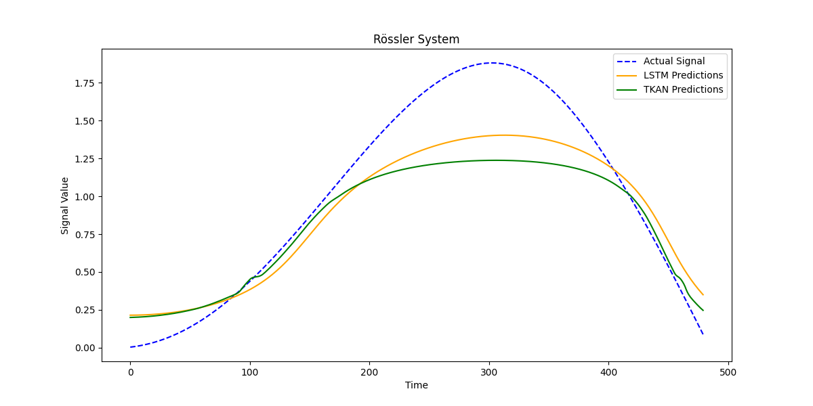

# TimeKAN


TimeKAN is a Pytorch implementation of integrating Kolmogorov-Arnold Networks (KAN) for temporal data with recurrent neural network architectures (Currently LSTM and GRU). It is still in an experimental stage, the implementation suffer from exploding gradients and vanishing gradients problems but with careful training it can perform well specifically on non-linear/complex temporal data.

Inspired by:
- [Kolmogorov-Arnold Networks](https://arxiv.org/abs/2404.19756)
- [Chebyshev Polynomial-Based KANs](https://arxiv.org/html/2405.07200), 
- [ChebyKAN](https://github.com/SynodicMonth/ChebyKAN)
- [FourierKAN](https://github.com/GistNoesis/FourierKAN/)
- [TKAN](https://arxiv.org/pdf/2405.07344)



In `tKANLSTM`, KAN layers replace the output gate, computing $o_t = \sigma(\text{KAN}(W_x x_t + W_h h_{t-1}))$. In `tKANGRU`, they form the candidate hidden state, $\tilde{h}_t = \tanh(\text{KAN}(W_x x_t + W_h (r_t \odot h_{t-1})))$. The layer basis functions can be Fourier series, Chebyshev polynomials, or splines.

Here's how it can perform on Rossler system signal:



The table below compares TimeKAN (using `tKANLSTM` and
`spline` as basic functions) and a standard bidirectional
LSTM on three chaotic datasets available in
`timekan.utils.datasets`. Metrics include Mean Absolute
Error (MAE) and training time (seconds) until convergence.

|      Dataset    |    Model   |     MAE   |   Training Time (s)  | 
|:---------------:|:----------:|:---------:|:--------------------:|
|   Mackey-Glass  |   LSTM     |   0.0893  |   0.3346             |
|                 |   TimeKAN  |   0.0822  |   9.8755             |
|   Lorenz        |   LSTM     |   0.9410  |   1.1331             |
|                 |   TimeKAN  |   0.7485  |   7.9437             |
|   Rössler       |   LSTM     |   0.3332  |   1.3951             |
|                 |   TimeKAN  |   0.2657  |   12.4172            |

## Installation

Install TimeKAN via pip:

```bash
pip install timekan
```

Alternatively, clone the repository and install locally:

```bash
git clone https://github.com/SamerMakni/timekan.git
cd timekan
pip install .
```
Requirements: Python >= 3.9, PyTorch >= 2.4.0

## Usage

Full documentation can be found [here](https://samermakni.github.io/timekan/).

Here’s a simple example training a TKANLSTM on Mackey-Glass data:

```python
import torch
import torch.nn as nn
from timekan.models.tkan_lstm import tKANLSTM
from timekan.utils.datasets import mackey_glass

class RecurrentKAN(nn.Module):
    def __init__(self, input_dim, hidden_dim):
        super().__init__()
        self.tkan = RecurrentKAN(
            input_dim=input_dim,
            hidden_dim=hidden_dim,
            return_sequences=False,
            bidirectional=True,
            kan_type='fourier',
            sub_kan_configs={'gridsize': 50, 'addbias': True}
        )
        self.regressor = nn.Linear(hidden_dim * 2, 1)

    def forward(self, x):
        features = self.tkan(x)
        return self.regressor(features).squeeze(-1)

x_train, y_train, x_test, y_test = mackey_glass()

model = RecurrentKAN(input_dim=1, hidden_dim=16)
criterion = nn.MSELoss()
optimizer = torch.optim.Adam(model.parameters(), lr=0.001)

for epoch in range(10):
    model.train()
    optimizer.zero_grad()
    outputs = model(x_train)
    loss = criterion(outputs, y_train)
    loss.backward()
    optimizer.step()
    print(f"Epoch {epoch + 1}/10, Training MSE: {loss.item():.4f}")

model.eval()
with torch.no_grad():
    test_outputs = model(x_test)
    test_mse = criterion(test_outputs, y_test).item()
    print(f"Test MSE: {test_mse:.4f}")
```

